Amazon.com is the largest online retailer in the world. One of the best things about Amazon is the ability to download order reports in CSV format. In this project, I provide insight into my Amazon order history spanning 2008 to 2019, inclusive. I use python, pandas, matplotlib and SQLAlchemy to clean, analyze and persist data. The ETL process is automated using Airflow. 

  
  
  
  
  
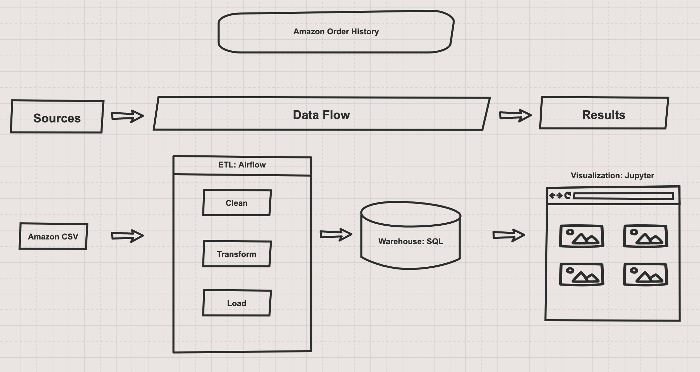

This repository includes a [JupyterNotebook](https://github.com/AmitSamra/AmazonOrderHistory/blob/master/AmazonOrderHistory.ipynb), which contains all of the code used to generate the following report. 

# Table of Contents

1. [Data Processing](https://github.com/AmitSamra/DataEngineering.Labs.AirflowProject#1-data-processing)
2. [Data Analysis](https://github.com/AmitSamra/DataEngineering.Labs.AirflowProject#2-data-analysis)
3. [SQL](https://github.com/AmitSamra/DataEngineering.Labs.AirflowProject#3-sql)

# 1. Data Processing

The following is a the raw dataframe generated by reading [amazon_purchases.csv](img/amazon_purchases.csv) into Python Pandas. Note how columns are formatted incorrectly and many fields are missing. 

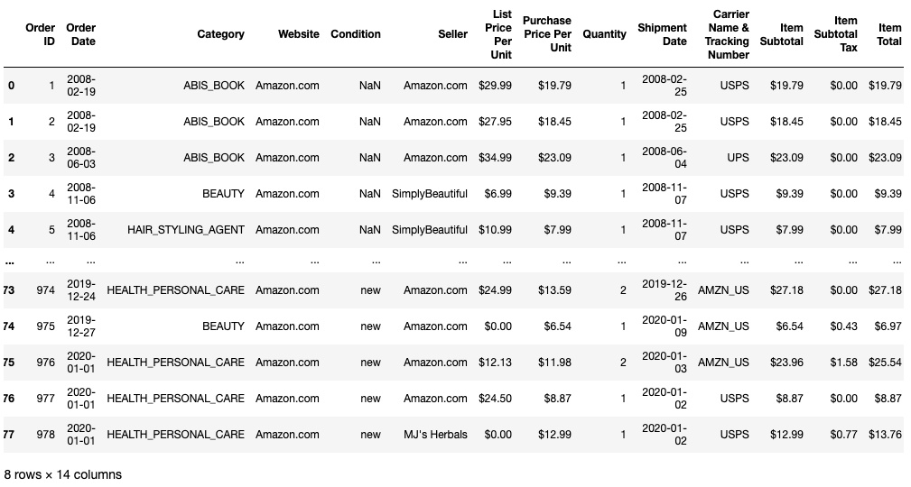

Data cleaning is an important part of the ETL process. The following shows the final dataframe. Note how the formatting and rows containing NaN have been replaced or removed.

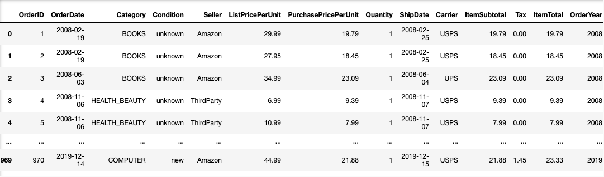

[Home](https://github.com/AmitSamra/DataEngineering.Labs.AirflowProject#)

# 2. Data Analysis

Let's begin with a striking number: $30,000. That's how much I spent on Amazon over the last 12 years. 

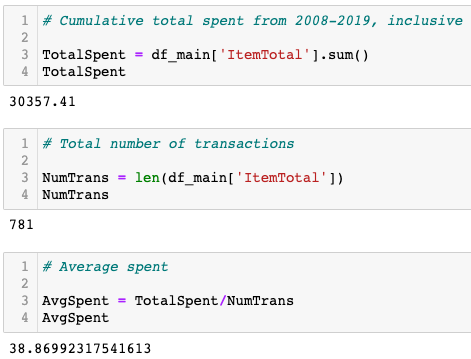

It took 781 transactions to achieve this number. 2019 marked a sharp increase in my transactions, surpassing the peak I hit in 2011. 

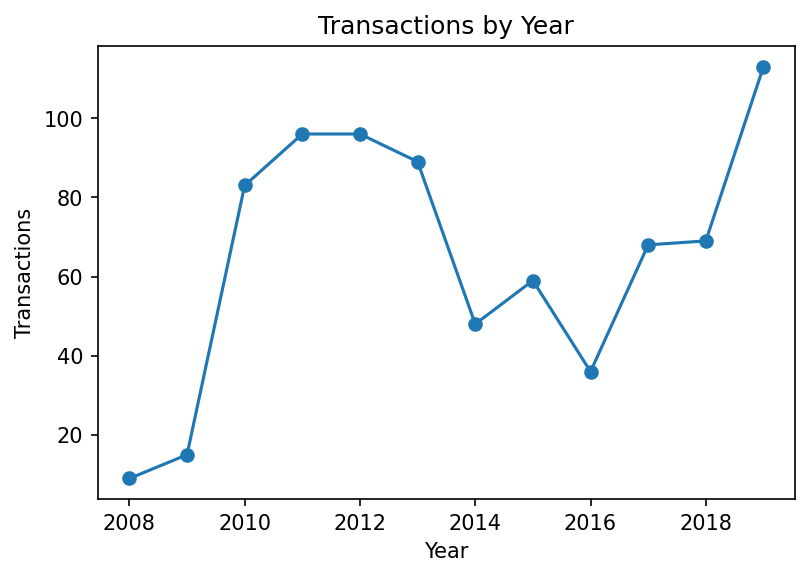

My average transaction size was almost $40.

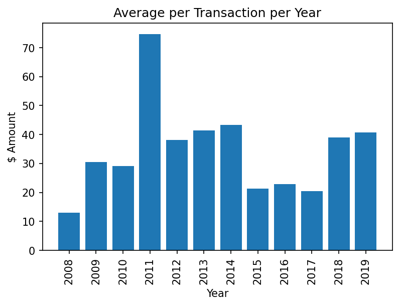

The following shows my daily purchase totals. Most of my transactions seem to be below $50 with occasional big-ticket purchases. 

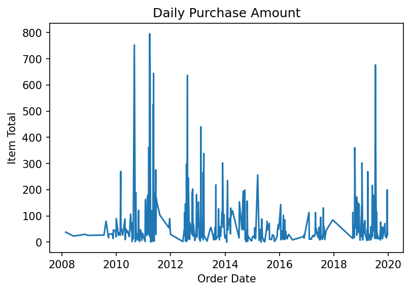

This graph shows what seems to be an outlier. I spent over $7,000 in 2011. 

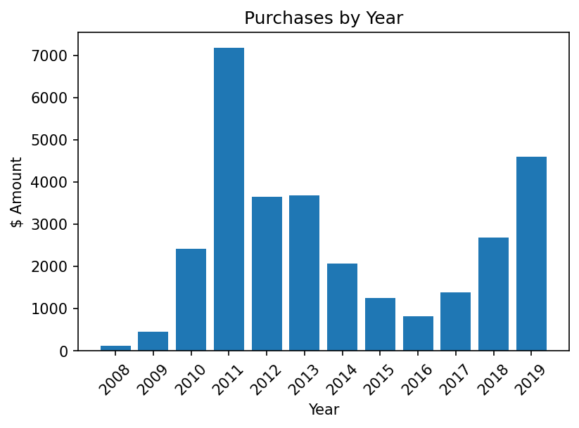

It seems that I spent the most amount in March, July and August and not during Christmas. 

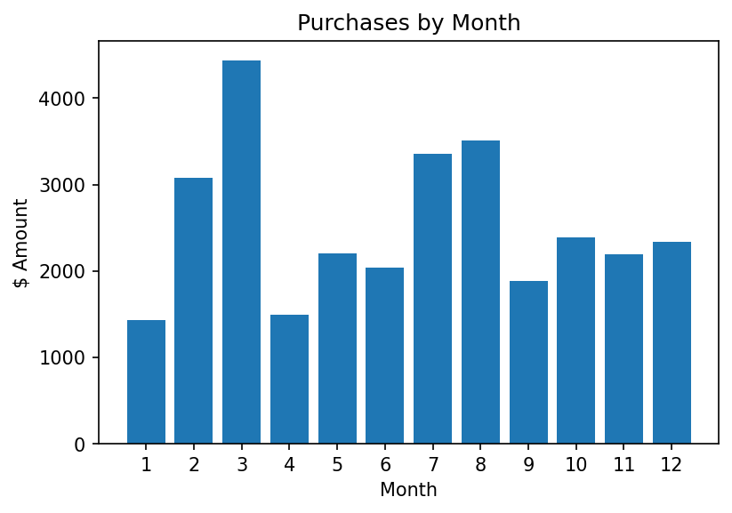

Is there any particular day that I purchased more frequently? Yes, Monday. I seem to haved ordered more in the beginning of the week, likely due to the chances of things being delivered quickly on a weekday. 

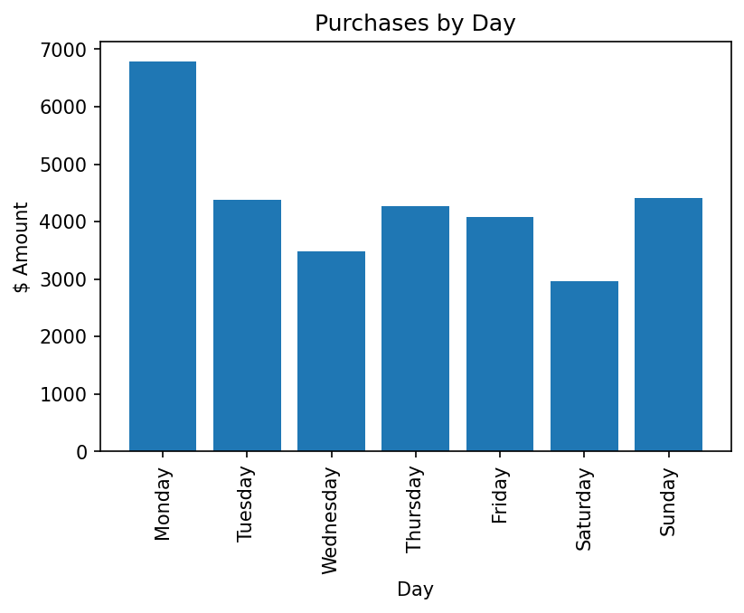

Most of my purchases on Amazon were for Computers and Electronics equipment. 

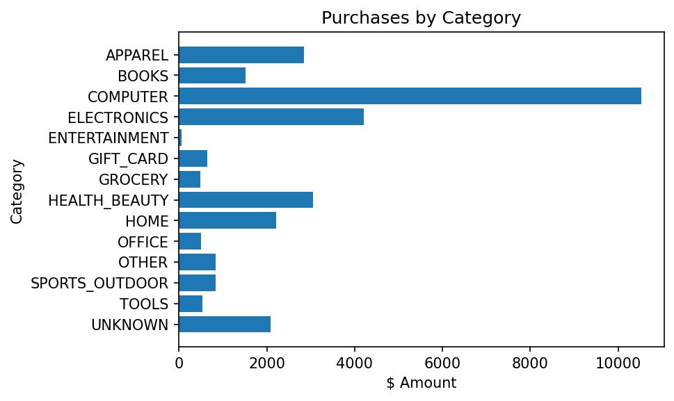

The two categories accounted for nearly 50% of my Amazon purchases. 

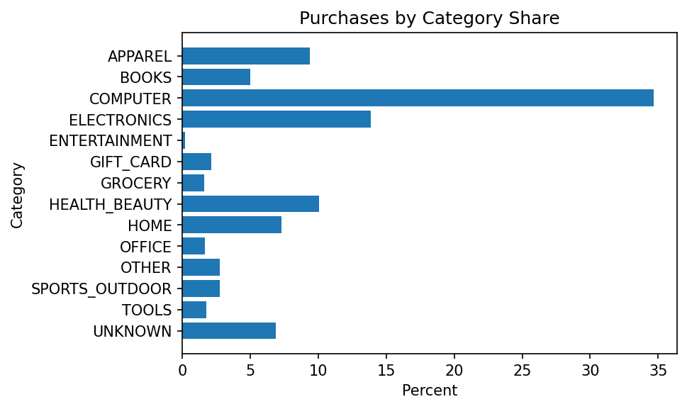

Almost 60% of my transactions were with Amazon as the seller. 

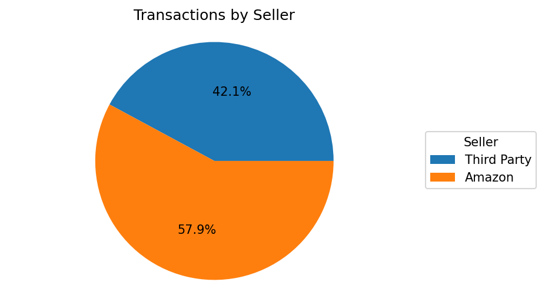

But Amazon accounted for 75% of my purchase spend. Perhaps it's the generous returns policy for goods sold directly by Amazon. 

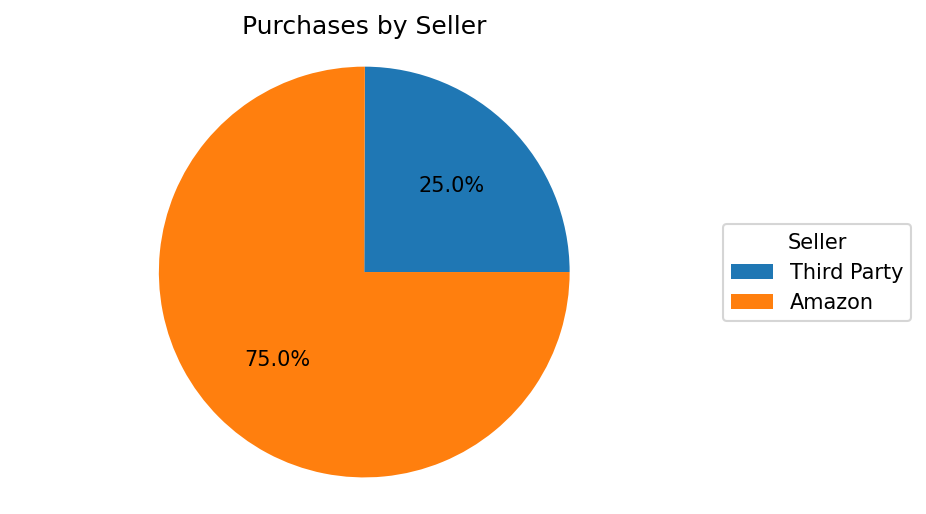

Most orders were shipped using USPS folowed by Amazon's in-house delivery service. 

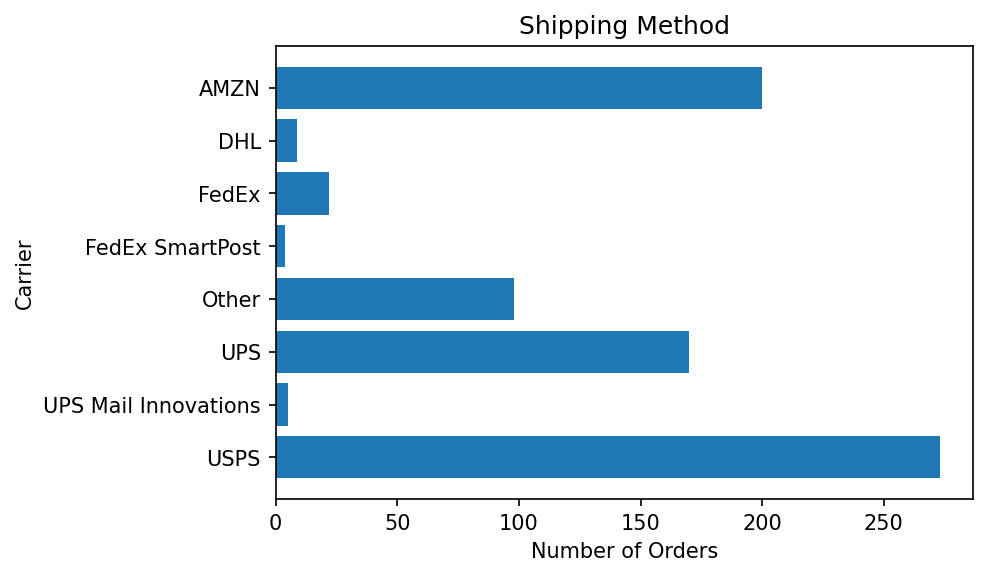

However, orders with the highest value were shipped with either FedEx or UPS. 

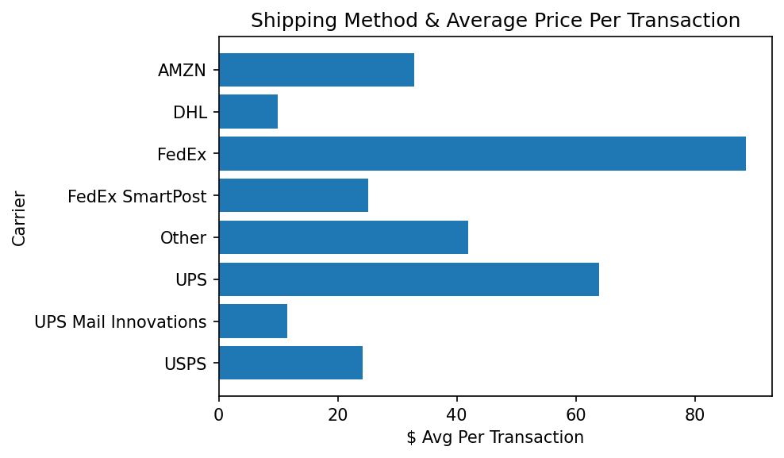

[Home](https://github.com/AmitSamra/DataEngineering.Labs.AirflowProject#)

# 3. SQL

One of the best things about Python is that we can actually source our data directly from SQL. The following shows a dataframe that I both created and sourced by using SQLAlchemy. 

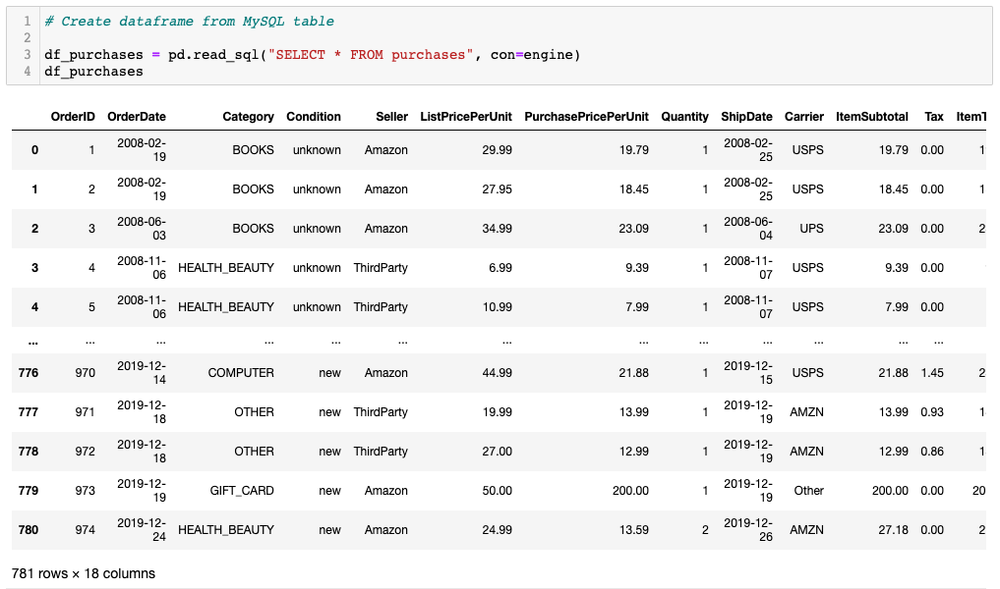

SQLAlchemy can be used to directly query data from a SQL database. The queries can then be utilized inside Python. 

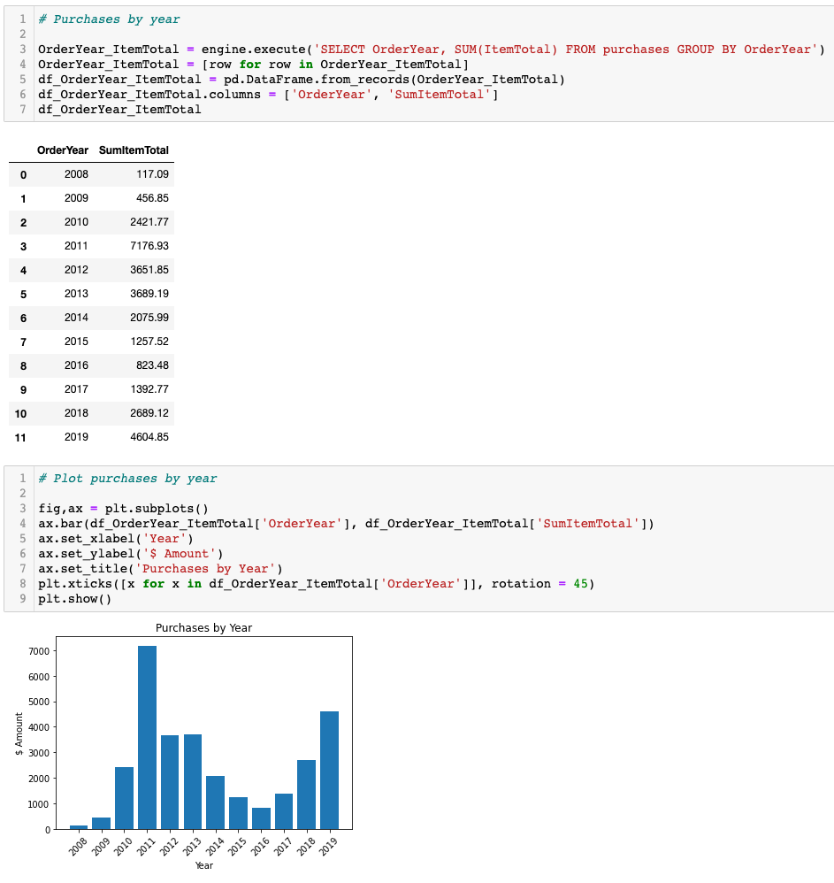

This concludes my presentation. Thank you! 

[Home](https://github.com/AmitSamra/DataEngineering.Labs.AirflowProject#)

